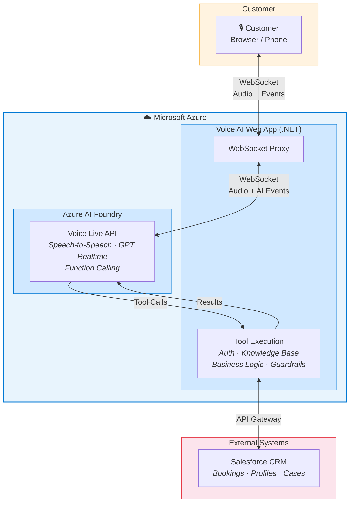
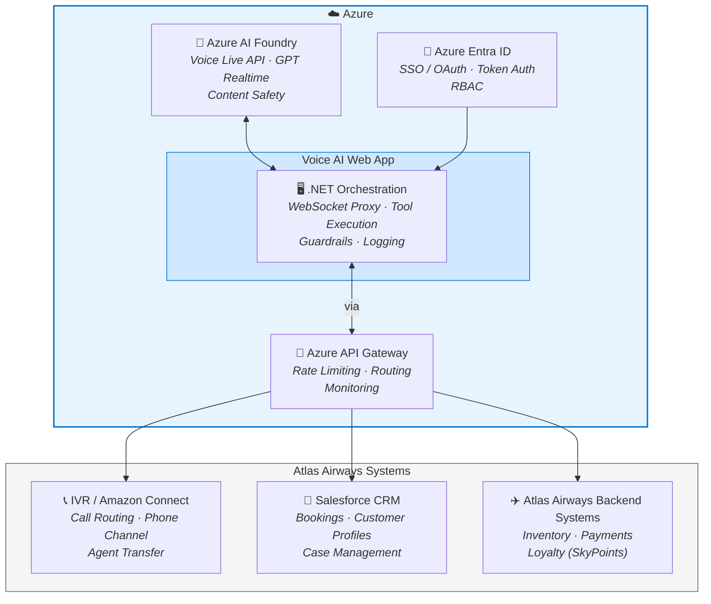
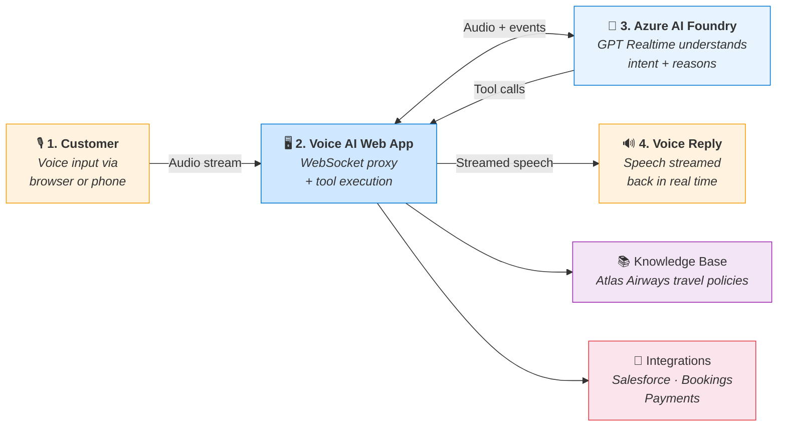

# Solution Architecture & Integration

---

## Slide 1 — High-Level Architecture

**Key points:**

- **Fully hosted on Microsoft Azure** — AI Foundry, App Services, Entra ID
- **Speech-to-speech** — no separate STT/TTS pipeline, lowest latency
- **Server-side function calling** — LLM decides when to call tools, backend executes securely
- **All customer data stays within Azure tenant** — no third-party processing

---

## Slide 2 — Integration Points

**Key points:**

- **Salesforce CRM** — Read/write bookings, customer profiles, case creation via REST API
- **Azure API Gateway** — Single entry point for all backend integrations; auth, throttling, observability
- **IVR / Amazon Connect** — Voice bot deployed as a contact flow; seamless handoff to human agents
- **Azure Entra ID** — Unified identity across all systems, no API keys in production

---

## Slide 3 — Data Flow & Orchestration

**Orchestration flow:**

1. **Customer** — Voice audio streams to our web app over WebSocket
2. **Voice AI Web App** — Proxies audio to Azure AI Foundry; intercepts and executes tool calls server-side
3. **Azure AI Foundry** — Processes speech natively via GPT Realtime; reasons over context and decides which tools to call
4. **Voice Reply** — Response generated as speech by the model, streamed back through the web app with sub-second latency

**All steps happen in a single streaming round-trip — no handoffs between separate STT → LLM → TTS services.**
